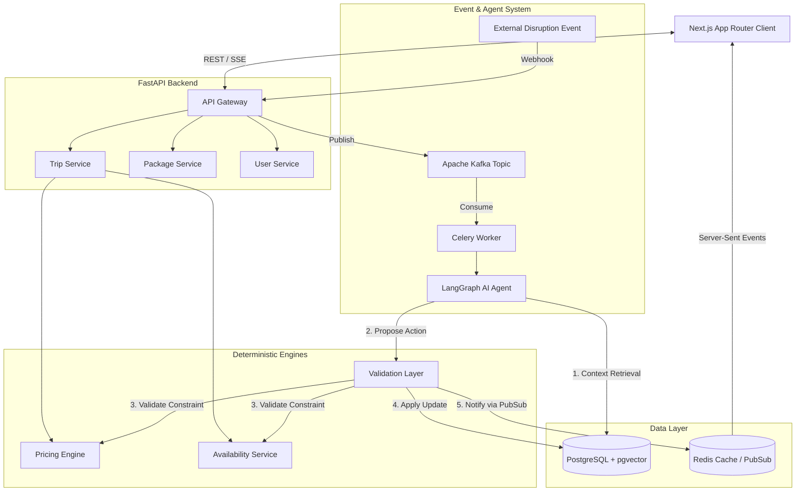
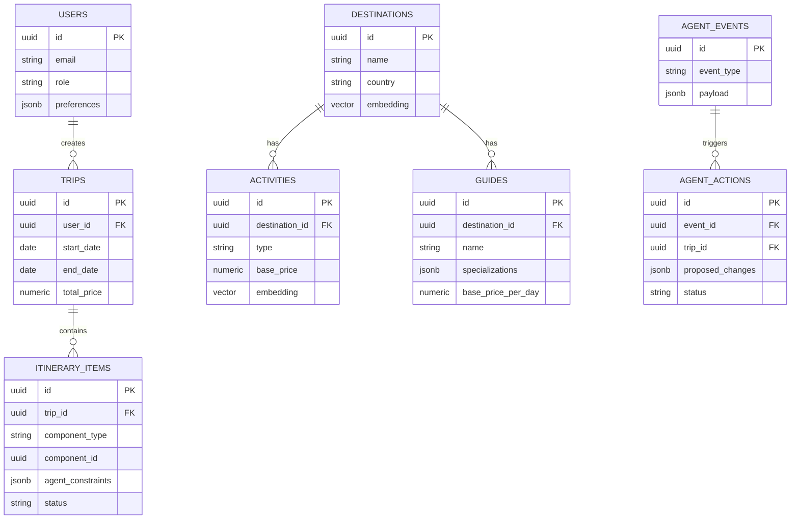
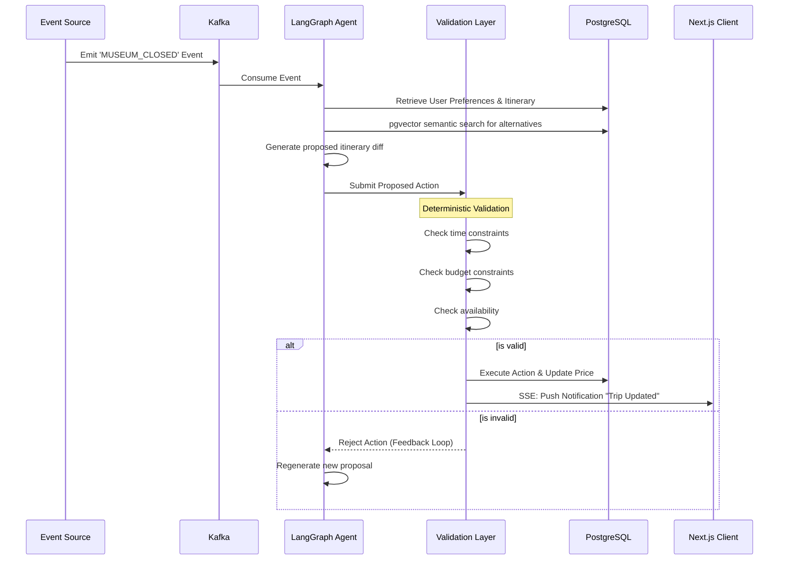

# PackagePro — Dynamic Tour Packages 🌍

PackagePro is a production-grade, event-driven travel platform that allows users to create dynamic, highly personalized tour packages. 

Unlike conventional travel booking platforms, PackagePro features an **Autonomous Event-Driven Trip Agent** that dynamically responds to real-world disruptions (e.g., attraction closures, weather changes) by deterministically finding and validating alternative itinerary items in real-time, all while preserving the user's budget, schedule, and preferences.

This repository serves as a showcase of modern software engineering practices, prioritizing maintainability, scalability, clean architecture, and deterministic AI validation over rapid prototyping.

---

## 🎯 Core Capabilities

1. **Dynamic Tour Package Builder**: Customize destinations, durations, guides, and activities.
2. **Deterministic Pricing Engine**: Strict decoupling of pricing logic from AI. All prices are calculated securely and deterministically via backend services.
3. **Local Tour Guide System**: First-class domain representation of guides with specializations, real-time availability, and language capabilities.
4. **Autonomous AI Trip Agent**: An event-driven background service (LangGraph + Kafka) that detects itinerary disruptions, semantically searches for replacements via `pgvector`, validates them against user constraints, and proposes seamless updates.
5. **Adaptive Itineraries**: Granular constraints (e.g., `preserve_budget`, `replacement_allowed`) on every itinerary item.

---

## 🏗️ System Architecture

The application follows a highly decoupled, service-oriented architecture. The frontend is cleanly separated from the FastAPI backend, and heavy AI/Agent workloads are offloaded to background workers via Kafka and Celery.



---

## 💾 Domain Model (ER Diagram)

The database acts as the single source of truth. We use PostgreSQL with the `pgvector` extension for semantic search (RAG) when the AI agent hunts for alternative activities.



---

## 🤖 The Autonomous Event-Driven Agent Workflow

One of the strict safety rules of this project is that **the AI must NEVER have unrestricted authority over the database**. 



---

## 🛠️ Technology Stack & Justification

### Frontend
* **Next.js (App Router) & React**: Server-side rendering for SEO (curated packages) and highly interactive client components for the dynamic trip builder.
* **Tailwind CSS & shadcn/ui**: For a premium, accessible, and highly customizable UI system.
* **TanStack Query & Zustand**: For handling complex server-state synchronization and client-side builder state.
* **Framer Motion**: For fluid micro-interactions, especially when communicating AI agent activity.

### Backend
* **Python & FastAPI**: Chosen for its native asynchronous support, Pydantic data validation, and seamless integration with the Python AI ecosystem.
* **SQLAlchemy 2.0 & Alembic**: Robust ORM and migration management.
* **Apache Kafka & Celery**: For decoupled, highly scalable event streaming and background task processing.
* **Redis**: Used as a caching layer, for distributed locking, and as a PubSub broker for real-time Server-Sent Events (SSE).

### Data & AI
* **PostgreSQL + pgvector**: A unified data layer preventing the need for a separate vector database. Handles both relational constraints and semantic similarity search.
* **LangGraph**: Orchestrates the multi-step AI reasoning loops (Context -> Search -> Plan -> Submit), allowing cyclic feedback from the deterministic Validation Layer.

---

## 🚀 Getting Started

### Prerequisites
- Docker & Docker Compose
- Python 3.10+
- Node.js 18+

### 1. Start the Infrastructure
Spin up PostgreSQL (with pgvector), Redis, Zookeeper, and Kafka.
```bash
docker-compose up -d
```

### 2. Backend Setup
```bash
cd backend
python -m venv venv
source venv/bin/activate
pip install -r requirements.txt

# Run migrations and seed data
alembic upgrade head
export PYTHONPATH=.
python app/db/seed.py

# Start the FastAPI server
uvicorn app.main:app --reload --port 8000
```

### 3. Frontend Setup
```bash
cd frontend
npm install
npm run dev
```

---

## 🧪 Quality Assurance & Observability

- **Unit Testing**: Strict `pytest` coverage for the deterministic `PricingEngine` and `ValidationLayer`.
- **E2E Testing**: Playwright for critical user flows (e.g., custom package builder -> price calculation -> checkout).
- **Audit Trails**: Every action proposed by the LangGraph agent is durably recorded in the `agent_actions` table, creating a transparent, auditable history of AI decision-making.

---
*Built as a Final Year Project to demonstrate scalable, production-grade architectural design.*
