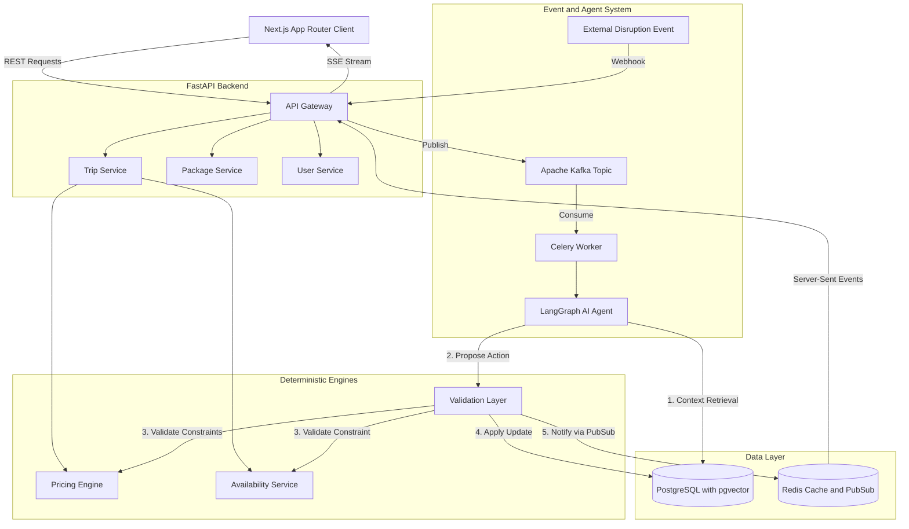
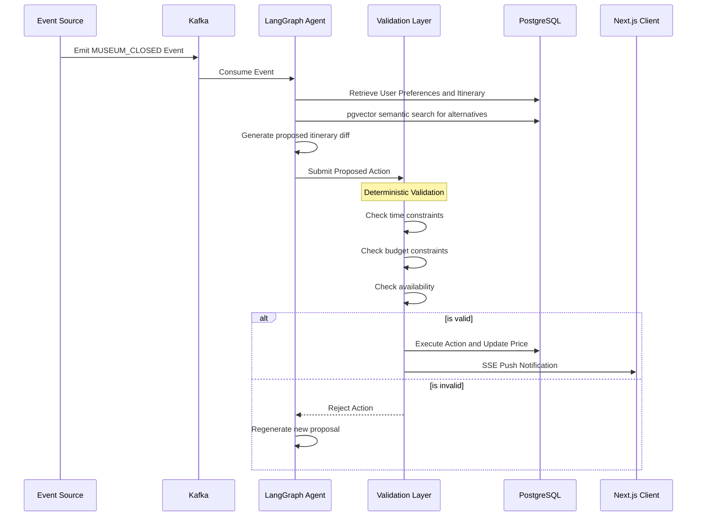

# PackagePro - Dynamic Tour Packages

PackagePro is a production-grade, event-driven travel platform that allows users to create dynamic, highly personalized tour packages. 

Unlike conventional travel booking platforms, PackagePro features an Autonomous Event-Driven Trip Agent that dynamically responds to real-world disruptions (e.g., attraction closures, weather changes) by deterministically finding and validating alternative itinerary items in real-time, all while preserving the user constraints.

This repository serves as a showcase of modern software engineering practices, prioritizing maintainability, scalability, clean architecture, and deterministic AI validation over rapid prototyping.

---

## Core Capabilities and Features

1. **Dynamic Tour Package Builder**: Customize destinations, durations, guides, and activities with granular constraints.
2. **Deterministic Pricing Engine**: Strict decoupling of pricing logic from AI. All prices, taxes, and margins are calculated securely and deterministically via backend services.
3. **Local Tour Guide System**: First-class domain representation of guides with specializations, real-time availability, and language capabilities.
4. **Autonomous AI Trip Agent**: An event-driven background service that detects itinerary disruptions, semantically searches for replacements via pgvector, validates them against user constraints, and proposes seamless updates.
5. **Real-time Synchronization**: Server-Sent Events (SSE) push updates from the backend to the client instantly when the agent modifies an itinerary.

---

## System Design

The architecture is designed to handle asynchronous event processing while maintaining strict transactional integrity for financial and booking data. Heavy AI workloads are offloaded to background workers via Kafka and Celery, ensuring the API remains highly responsive.

### High-Level Architecture



### Domain Model

The database acts as the single source of truth. We use PostgreSQL with the pgvector extension for semantic search (RAG) when the AI agent hunts for alternative activities.


### Autonomous Event-Driven Agent Workflow

One of the strict safety rules of this project is that the AI must never have unrestricted authority over the database. All AI-generated proposals must pass through a deterministic validation layer.



---

## Technology Stack and Justification

### Frontend
* **Next.js (App Router) and React**: Chosen for hybrid rendering. Server-side rendering is utilized for SEO-heavy pages (curated packages), while highly interactive client components are used for the dynamic trip builder.
* **Tailwind CSS and shadcn/ui**: Provides a modular, accessible, and highly customizable UI system without the overhead of heavy component libraries.
* **TanStack Query and Zustand**: Handles complex server-state synchronization and client-side builder state independently.

### Backend
* **Python and FastAPI**: Chosen for native asynchronous support, rigorous Pydantic data validation, and seamless integration with the Python machine learning and AI ecosystem.
* **SQLAlchemy 2.0 and Alembic**: Provides a robust, enterprise-grade ORM and schema migration pipeline.
* **Apache Kafka and Celery**: Implements a highly scalable, decoupled event streaming architecture. Ensures that webhooks and user requests do not block while the AI computes alternatives.
* **Redis**: Functions as a caching layer, a distributed locking mechanism, and a PubSub broker for real-time Server-Sent Events (SSE).

### Data and AI
* **PostgreSQL and pgvector**: Creates a unified data layer. Combining relational data with vector embeddings in the same database eliminates the consistency issues of maintaining a separate vector database.
* **LangGraph**: Orchestrates multi-step AI reasoning loops (Context, Search, Plan, Submit), enabling cyclic feedback loops when the deterministic Validation Layer rejects an invalid itinerary proposal.

---

## Estimate Analysis (Capacity Planning)

### Traffic Assumptions
* **Daily Active Users (DAU)**: 10,000
* **Trips Created Per User Per Month**: 2
* **Average Itinerary Items Per Trip**: 15
* **External Disruption Events Per Day**: 5,000

### Storage Estimates
* **Relational Data**: 
  - Users, Trips, and Itineraries: ~50MB / month
  - Agent Action Audit Logs: ~100MB / month
* **Vector Data (pgvector)**:
  - 100,000 Activities/Destinations * 1536 dimensions * 4 bytes = ~600MB memory footprint. Easily fits in standard PostgreSQL RAM.
* **Total Storage**: ~2GB per year, well within standard RDS limits.

### Throughput Estimates
* **Read Heavy / Write Light**: Typical for travel planning. 
* **API Requests**: ~50 requests / sec at peak.
* **Kafka Event Ingestion**: ~0.1 MB/s (Low throughput, high value).
* **AI Agent Execution time**: 5-10 seconds per disruption event. 
* **Worker Capacity**: 10 Celery workers processing concurrently can handle 5,000 events/day smoothly without bottlenecks.

---

## Getting Started

### Prerequisites
- Docker and Docker Compose
- Python 3.10+
- Node.js 18+

### 1. Start the Infrastructure
Start PostgreSQL, Redis, Zookeeper, and Kafka.
```bash
docker-compose up -d
```

### 2. Backend Setup
```bash
cd backend
python -m venv venv
source venv/bin/activate
pip install -r requirements.txt

# Run migrations and seed data
alembic upgrade head
export PYTHONPATH=.
python app/db/seed.py

# Start the FastAPI server
uvicorn app.main:app --reload --port 8000
```

### 3. Frontend Setup
```bash
cd frontend
npm install
npm run dev
```

---

## Quality Assurance and Observability

- **Unit Testing**: Strict pytest coverage for the deterministic PricingEngine and ValidationLayer.
- **E2E Testing**: Playwright for critical user flows (e.g., custom package builder, price calculation, checkout).
- **Audit Trails**: Every action proposed by the LangGraph agent is durably recorded in the agent_actions table, creating a transparent, auditable history of AI decision-making.

---
Built as a Final Year Project to demonstrate scalable, production-grade architectural design.
